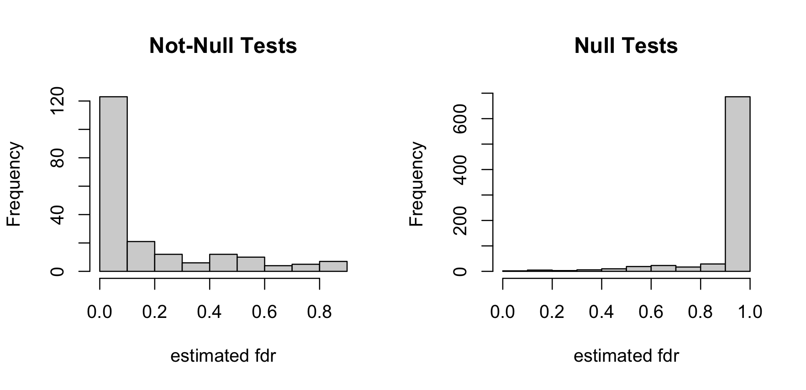

# fdrSAFE

<!-- badges: start -->

<!-- badges: end -->

## Overview

`fdrSAFE` is a data-driven selective ensembling algorithm for estimating local (fdr) and tail-end (Fdr) false discovery rates in large-scale multiple hypothesis testing. This method is introduced in the paper [*fdrSAFE: Selective Ensembling for False Discovery Rates*](https://arxiv.org/abs/2401.12865). For the code to replicate all results reported in the paper, see the [jennalandy/fdrSAFE_PAPER](https://github.com/jennalandy/fdrSAFE_PAPER) repository.

## Installation

```{r setup, eval = FALSE}
# install package from GitHub:
# install.packages("devtools")
library(devtools)
devtools::install_github("jennalandy/fdrSAFE")

library(fdrSAFE)
```

## Quick Start

Simulate test statistics and hypothesis truth labels

```{r eval = FALSE}
test_statistics = c(
  rnorm(800, 0, 1),       # 80% of values near 0
  runif(66, -6, -2.5),    # add 6.6% negative extreme values
  runif(134, 1.5, 4.5)    # add 13.4% positivive extreme values
)
truth = c(rep(FALSE, 800), rep(TRUE, 200))
```

Run fdrSAFE to estimate local fdr

```{r}
fdrSAFE_res <- fdrSAFE(test_statistics)
```

Visualize local fdr, split by hypothesis truth label

```{r}
par(mfrow = c(1, 2))
hist(fdrSAFE_res$fdr[truth], main = "Not-Null Tests", xlab = "estimated fdr")
hist(fdrSAFE_res$fdr[!truth], main = "Null Tests", xlab = "estimated fdr")
```

{width="537"}

Prediction accuracy using a cutoff of 0.2

```{r}
pred = fdrSAFE_res$fdr < 0.2
table(pred, truth)
```

```         
       truth
pred    FALSE TRUE
  FALSE   793   56
  TRUE      7  144
```

## More Details in [vignette](vignettes/fdrSAFE.Rmd)
