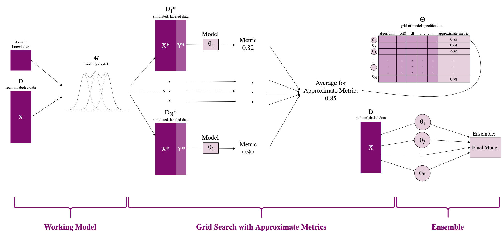

# gridsemblefdr

<!-- badges: start -->
<!-- badges: end -->

## Overview

`gridsemblefdr` computes local and tail-end false discovery rates using ensemble methods. This method is introduced in the in-progress paper "Ensembling for Unsupervised Learning with Application to False Discovery Rates".

Unsupervised models present a unique challenge for hyperparameter optimization because measures of accuracy used in standard supervised techniques cannot be computed. In practice, this means hyperparameters are chosen differently by each researcher and are often left as the default values in their package of choice. We introduce a novel ensemble framework to address this issue for unsupervised problems with latent labels. This framework selects models to ensemble by their approximate performances, which are estimated using simulated labeled data informed by domain knowledge of the latent label structure. We implement our framework to improve existing false discovery rate methodology, viewing multiple hypothesis testing as an unsupervised classification problem with binary latent labels. Our simulation studies show that an ensemble outperforms three popular methods with their default hyperparameters and that, within an ensemble, combining models chosen based on their approximate performances outperforms an ensemble over a random subset of models. The R package for the false discovery rate implementation of this framework, `gridsemblefdr`, can be installed here.

<p align="left">
  
</p>

## Installation
```{r setup, eval = FALSE}
# install package from GitHub:
# install.packages("devtools")
library(devtools)
devtools::install_github("jennalandy/gridsemblefdr")

library(gridsemblefdr)
```

## Quick start guide

Given a vector of test statistics, the `gridsemble` function can be used to compute local and tail-end false discovery rates. Here is an example using `gridsemblefdr` on a simulation study of 1000 t-statistics:

```{r eval = FALSE}
library(gridsemblefdr)

test_statistics = c(
  rnorm(900, 0, 3),   # 90% of values near 0
  runif(50, -10, -3), # add 5% negative extreme values
  runif(50, 3, 10)    # add 5% positivive extreme values
)

gridsemble_res <- gridsemble(test_statistics)
```

Local and tail-end false discovery rates, as well as the proportion of test statistics from the null distribution, pi0, can be accessed from the `gridsemble_res` object.

```{r eval = FALSE}
fdr <- gridsemble_res$fdr
Fdr <- gridsemble_res$Fdr
pi0 <- gridsemble_res$pi0
```

### Options

#### Number of Simulations and Ensemble Size

By default, `gridsemblefdr` will build `nsim = 10` simulated datasets to compute approximate metrics, and choose the top `ensemble_size = 10` set of hyperparameters from each to ensemble over. This can easily be changed by the user.

```{r eval = FALSE}
gridsemble_res <- gridsemble(
  test_statistics, 
  nsim = 5, 
  ensemble_size = 20
)
```

#### Hyperparameter Grids

The hyperparameter sets considered are set to the default grid values in the functions `build_locfdr_grid`, `build_fdrtool_grid`, and `build_qvalue_grid`. 

If a user wants a more personalized set of hyperparameters considered, they can build their own grids of options with these functions, or even exclude one of the three package from the ensemble entirely. Further, for continuous hyperparameters such as `pct_range`, the user can choose for the grid to be filled in with equally-spaced values (`method = 'grid'`), or with uniformly sampled values (`method = 'random'`).

```{r eval = FALSE}
my_locfdr_grid <- build_locfdr_grid(
  test_statistics,
  pct_range = c(0.001, 0.003),
  pct0_range = c(1/3,1/4),
  nulltype = c(1,2),
  type = c(0),
  method = 'grid'
)

my_fdrtool_grid <- build_fdrtool_grid(
  test_statistics,
  cutoff.method = c('fndr','pct0'),
  pct0_range = c(1/3,1/4),
  method = 'grid'
)

my_qvalue_grid <- build_qvalue_grid(
  test_statistics,
  transf = c('probit','logit'),
  adj_range = c(0.5, 1.5),
  pi0.method = c('bootstrap'),
  smooth.log.pi0 = c('FALSE'),
  method = 'grid'
)

gridsemble_res <- gridsemble(
  test_statistics,
  locfdr_grid = my_locfdr_grid,
  fdrtool_grid = my_fdrtool_grid,
  qvalue_grid = my_qvalue_grid
)
```

#### Size of Simulated Datasets

By default, the simulated datasets are the same size as the real data. If this is too large given a user's computational limitations, the size of simulated datasets can be specified with `sim_n`.

```{r eval = FALSE}
gridsemble_res <- gridsemble(
  test_statistics, 
  sim_n = 1000
)
```
